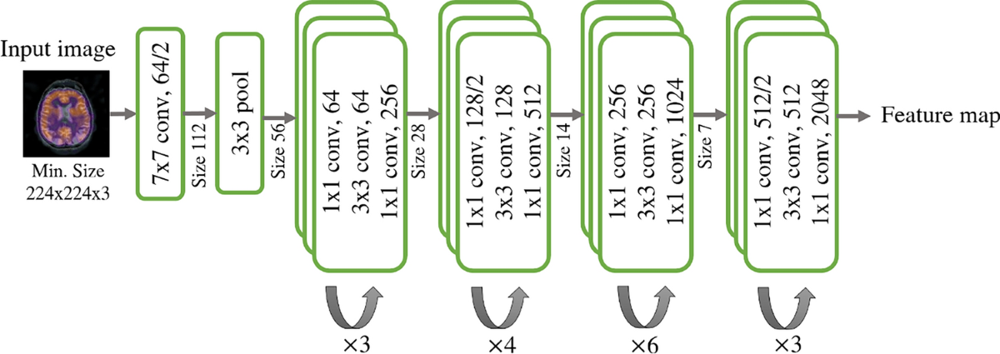
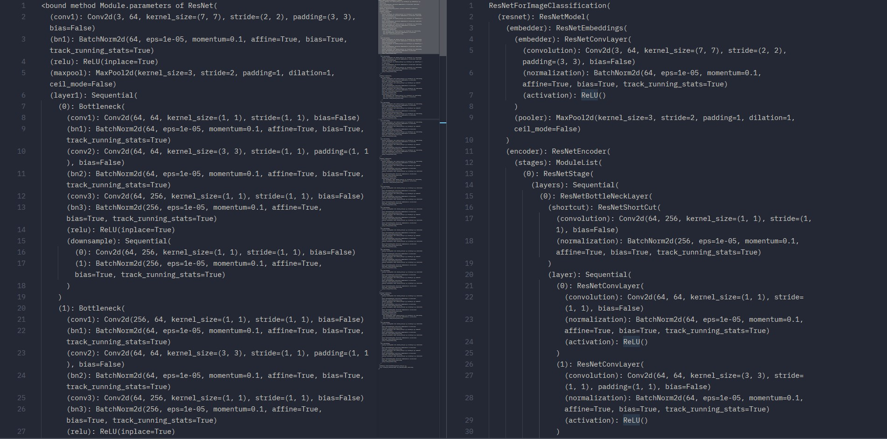
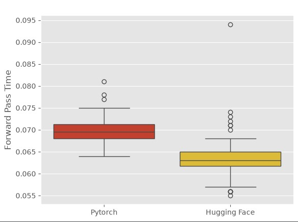

# SimCLR_From_Scratch

## Introduction

This repo is a deep dive to joint embedding world and more especially to the [SimCLR Paper](https://arxiv.org/abs/2002.05709) <i>(A Simple Framework for Contrastive Learning of Visual Representations)</i> written by T. Chen, S. Kornblith, M. Norouzi and G. Hinton.

Here i create from scratch in [Pytorch](https://docs.pytorch.org/docs/2.13/index.html) the networks, loss functions and the whole pipeline for **Contrastive Learning** training.

I split the work in the distinct parts in order to have cleaner structure and follow more easily the paper step by step, so the stages are:

1. [Image Augmentation](#image-augementation)
2. [Base Encoder](#base-encoder)
3. [Projection Head](#projection-head)
4. [Loss Functions](#loss-functions)
5. [Pipeline](#pipeline)

Finally i conduct some experiments in order to evaluate the work and validate the results.

## Dataset
As the base dataset i use the [evanarlian/imagenet_1k_resized_256](https://huggingface.co/datasets/evanarlian/imagenet_1k_resized_256) which is the **ImageNet already transforemd to 256 x 256 pixels** for smaller compute requirements, and because [datasets](https://github.com/huggingface/datasetss) support streaming mode which is very usefull for my case so i dont download the whole dataset locally.

## Image Augmentation
As specified in the paper the augmentation that stood out and was selected in the end was the following 3 image augmentation steps:
    
1. [Random Crop](https://docs.pytorch.org/vision/main/generated/torchvision.transforms.RandomCrop.html)
2. [Resize](https://docs.pytorch.org/vision/stable/generated/torchvision.transforms.v2.Resize.html)
3. [Color Distortion](https://docs.pytorch.org/vision/main/generated/torchvision.transforms.ColorJitter.html)
4. [Gaussian Blur](https://docs.pytorch.org/vision/main/generated/torchvision.transforms.GaussianBlur.html)
    

Below i am presenting a random sample from the dataset where the 1st image is the real one and the 4 remaining are examples where [image_augmentation](./src/augmentation.py) is performed.

***Important**: In the paper it is stated that <i>"Color histograms alone suffice to distinguish images. Neural net may exploit this shortcut to solve the predictive task"</i> and that is the reason that color distortion and gaussian blur are used, in order to mitigate this "hacky way" and let the model learn generalizable features.*
## Base Encoder
As presented in the paper they state clearly *"We opt for simplicity and adopt the commonly used ResNet"* in order to obtain h_i. More specifically they use **ResNet-50** (known also as ResNet v1.5) as said in *"We use ResNet-50 as the base encoder net-work and a 2-layer..."*

There are 2 at least implementations available:
* Left Image - [Pytorch ResNet-50](https://docs.pytorch.org/vision/main/models/generated/torchvision.models.resnet50.html)
* Right Image - [Hugging Face ResNet-50](https://huggingface.co/microsoft/resnet-50)

And compairing head to head Hugging Face implementation seems a little faster for some reason. (maybe they use compile, maybe lower precision automatically), but i am goind to use the pytorch implementation.

## Projection Head

The projection head is a very simple MLP with 2 layers as noted in *"We use MLP with one hidden layer to obtain z_i = g(h_i)=W^(2) * σ((W^(1))*h_i) where σ is a ReLU non linearity"*
## Loss Functions
## Pipeline
